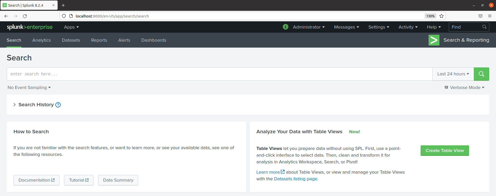
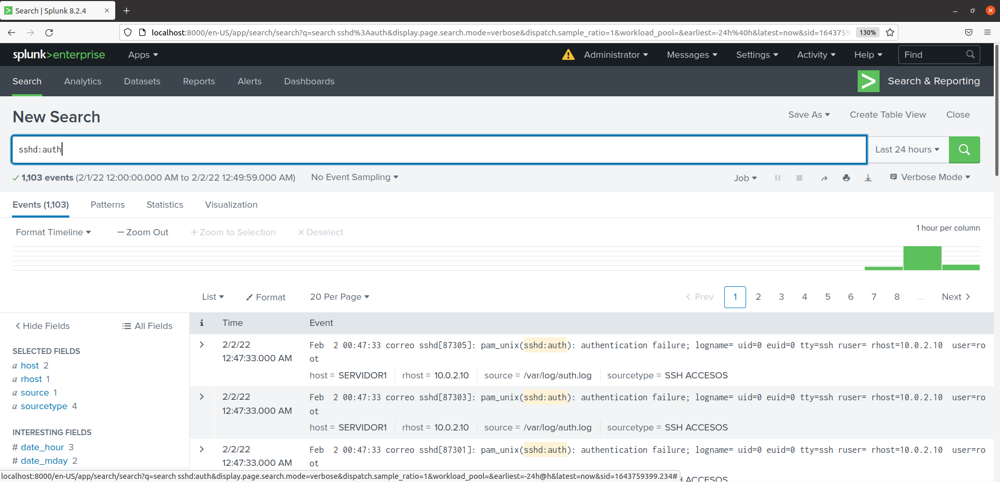

# splunk>

Es un software de agregación de datos o plataforma de Big Data que permite recolectar e indexar la información generada por cualquier dispositivo en tiempo real y buscar información dentro de ellos, siendo muy utilizado para análisis empresarial y web, gestión de aplicaciones, cumplimiento y seguridad. 

También es considerado como un servicio de Gestión de Información y Eventos de Seguridad (SIEM).

A partir de estos es posible crear alertas, paneles, gráficos, informes y visualizaciones legibles. Las funcionalidades que ofrece ayudan a las organizaciones a reconocer patrones de datos, diagnosticar problemas potenciales, aplicar inteligencia a las operaciones y generar métricas.

SPLUNK agregará toda la información correspondiente a los eventos de seguridad desde cualquier fuente a un solo sistema, lo que nos ayudará a eliminar el problema de tener que analizar la información en los distintos sistemas de seguridad para encontrar una amenaza. Por esta razón, también es conocido como INDEXER.

Esta solución propone específicamente crear una plataforma que permita la detección automatizada, generando alertas que serán enviadas automáticamente por email a los administradores de seguridad e incluirán IP y nombre del equipo posiblemente infectado, permitiendo a los analistas de seguridad tomar acciones.

**A destacar sobre Splunk>**

- Splunk es altamente escalable y fácil de implementar.
- Puede encontrar información útil dentro de los datos de manera automática.
- Guarda búsquedas y etiquetas que reconoce como información importante, hace que los sistemas sean más inteligentes.
- Ofrece una interfaz gráfica de usuario mejorada y una visibilidad en tiempo real.
- Los resultados instantáneos garantizan que se dedique menos tiempo a solucionar problemas.
- Permite incorporar inteligencia artificial (IA) en sus estrategias de datos y obtener inteligencia operativa a partir de los datos de sus máquinas.
- Puede recopilar cualquier forma de datos, incluidos CSV, JSON y formatos de registro.
- Las organizaciones pueden crear un repositorio central que les permita buscar datos de Splunk de múltiples fuentes.

**Desarrollo**

Una vez instalado en nuestro sistema (Ubuntu) y aceptada la licencia, lanzamos la instancia de SPLUNK> 

**Entorno con servidor proxy como *reenviador* o *forwarder*** 

Por ejemplo, Splunk es el encargado de importar todos los logs y realizar la comparación de los accesos de los usuarios con una lista de dominios maliciosos previamente definida (por ejemplo) y actualizada diariamente. Si un usuario accede a un dominio de la lista definida, una alerta que contiene la ip del usuario afectado, el sitio al que trata de acceder y el tiempo en el que se disparó alerta, es enviada al analista de seguridad.

*Prueba de Splunk con Proxy como reenviador*

**Características del Servidor Proxy para funcionar como reenviador**

El servidor también necesita el componente Forwarder de Splunk para poder enviar los access.log al indexer. El forwarder es instalado bajo el directorio /opt/splunkforwarder y sus configuraciones en el mismo directorio. Splunk forwarder usa el Puerto 9997 para el reenvío de datos. 

*Sección principal del Buscador de Splunk*

La manera más simple de enviar estos datos a Splunk es mediante el componente forwarder de Splunk, el mismo que reenvía los logs especificados al indexer en un formato entendible para Splunk.

El Servidor Splunk recibe los datos del servidor Proxy los almacena y los indexa. Un índice es un repositorio para datos de Splunk. Los datos recibidos son transformados en eventos y estos son asociados a un índice. Splunk asocia todos los datos en el índice principal si no se le indica otro índice. Este índice ayudará a organizar la información entrante y facilitar su eliminación en caso de ser necesario.

Splunk Indexer escucha los datos entrantes a través del Puerto 9997. 

**Monitorización de ficheros** 

Cabe la posibilidad de controlar ficheros log como el caso de los accesos por ssh a un servidor, protegiendo de posibles intentos por fuerza bruta al superar el nivel que se indique en nuestro indexador.

Una simple búsqueda del query “ssh” mostrará toda la información recibida desde el servidor proxy con datos relacionados a "ssh". 

Con la infraestructura lista, se debe proceder a obtener la información del log del servidor ssh en Splunk indexer. El archivo auth.log de ssh  es  el  que  contiene  los  datos  de nuestro interés.

El Servidor Splunk recibe los datos los almacena y los indexa. Un índice es un repositorio para datos de Splunk. Los datos recibidos son transformados en eventos y estos son asociados a un índice. Splunk asocia todos los datos en el índice principal si no se le indica otro índice. El índice  ssh:auth fue creado para asociar todos los datos provenientes del servidor ssh. Este índice ayudará a organizar la información entrante y facilitar su eliminación en caso de ser necesario.

El objetivo en este caso es enviar alertas cuando se intente varias veces acceder al servidor ssh instante en que realiza el acceso. Esto ayudará a prevenir daños futuros a la red y a la organización en general.

**Crear alertas en Splunk**

Completaremos nuestra busqueda de información con "authentication failure":

Guardaremos nuestro Report:

A partir de ahora eligiendo nuestro report nos dará la información más rápida ya que tiene predefinido los valores de búsqueda que queremos.

	

Para crear una alerta sobre nuestro report le indicamos ahora a splunk:

1. Tipo de alerta: en tiempo real.
2. Si se superan el valor de 5 intentos fallidos desde la misma máquina remota.
3. Se creará una alerta en nuestro Dashboard y enviará un correo con el aviso.

La alerta se podrá modificar y deshabilitar en todo momento en el panel de alertas creadas:

**Dashboard**

Es un panel donde podemos configurar gráficas y widgets para tener de forma visual un report sobre un evento:

En nuestro caso hemos configurado nuestro dashboard para que nos muestre cada minuto una gráfica con los intentos fallidos a nuestro servidor ssh a partir del quinto intento.

Se le pueden añadir otros paneles como estos:

